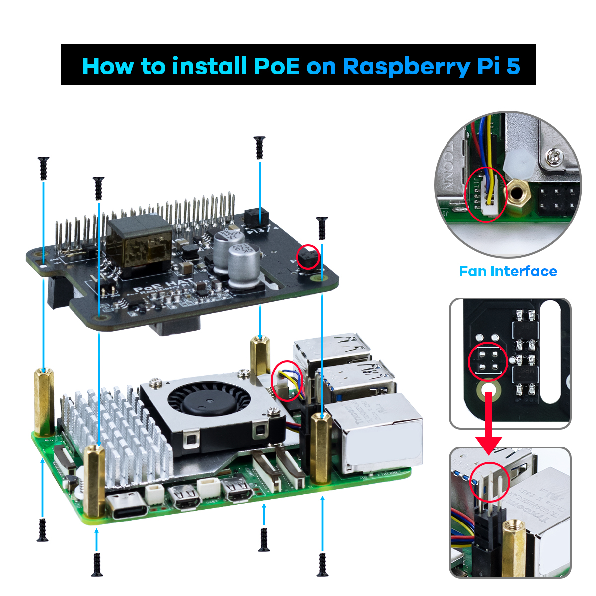

.. __Assembly:

Assembly
==========================

Installation video:  
.. raw:: html

   <video src="URL_TO_VIDEO" controls width="100%" title="PoE HAT Installation"></video>

(Replace `URL_TO_VIDEO` with the actual link.)

.. Tip::

   If adding cables or third-party heatsinks/peripherals, plan install order and check height to prevent metal contact that could short components.

