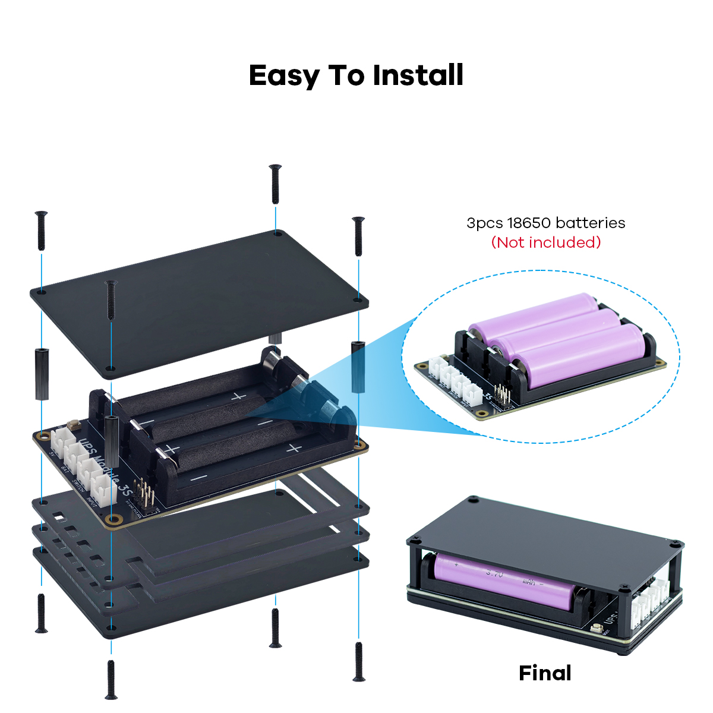
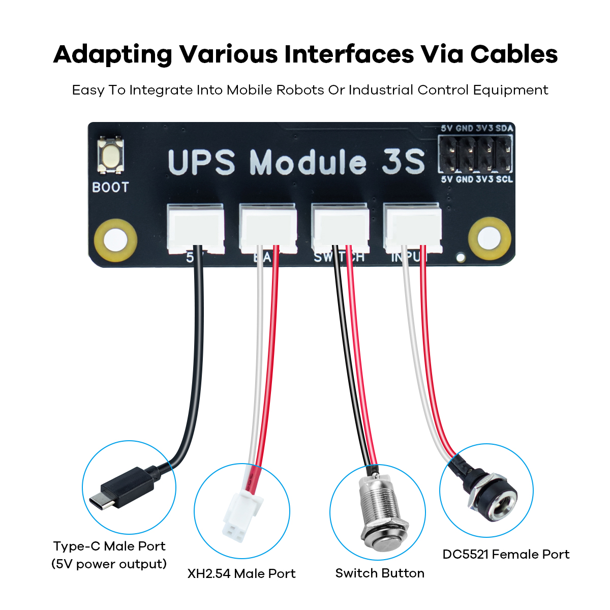

.. __Assembly:

Assembly
==========================

Installation video:  
.. raw:: html

   <video src="URL_TO_VIDEO" controls width="100%" title="PoE HAT Installation"></video>

(Replace `URL_TO_VIDEO` with the actual link.)

.. Tip::

   If adding cables or third-party heatsinks/peripherals, plan install order and check height to prevent metal contact that could short components.

.. note::

   If you plan to use I²C communication (e.g., power monitoring) or any other external functions, connect the corresponding wires to the multifunction expansion pins **according to the silkscreen labels(5V 3V3 GND SDA SCL)** before installing the acrylic cover.

.. note::

   These four wires should also be connected **before** the acrylic cover is installed.