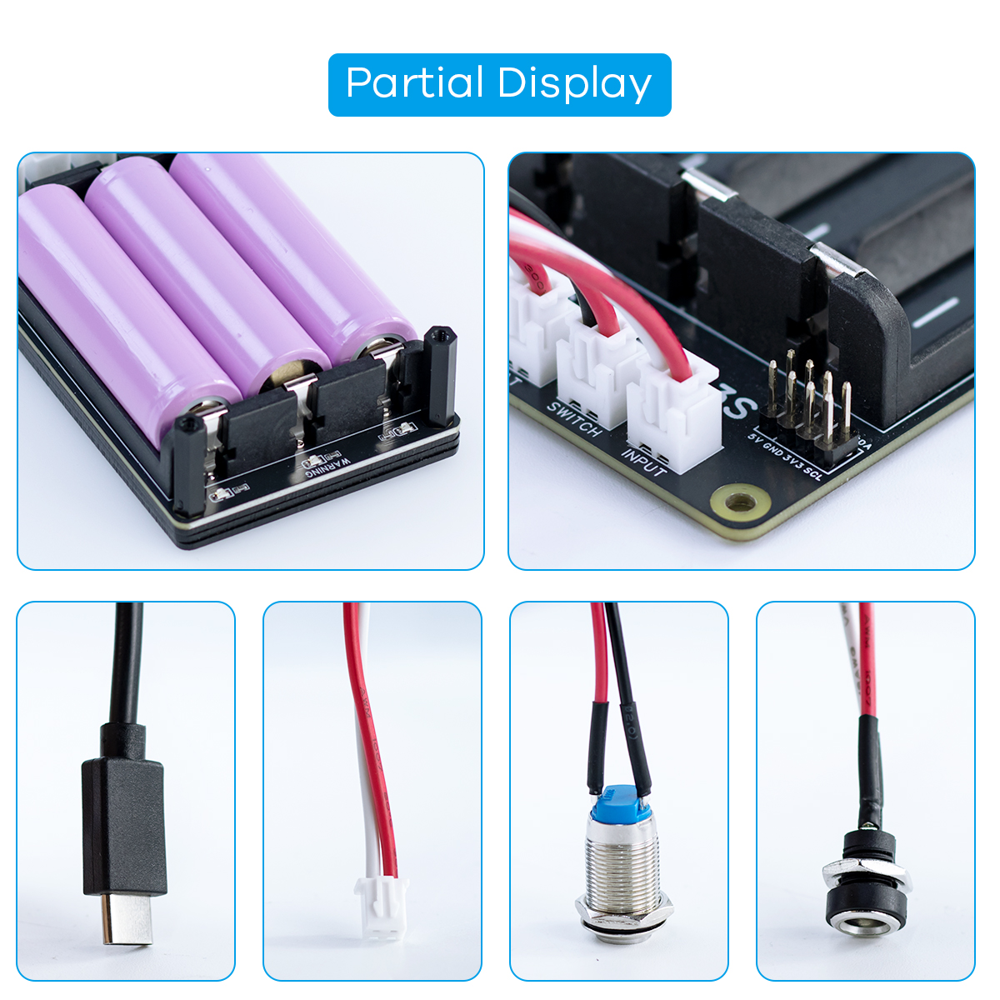

.. __about_this_kit:

About_this_kit
====================

Preface
-------------------------------

We first need to understand what an POE HAT is. The illustration below shows an POE HAT.

   

Our PoE HAT is a Power over Ethernet expansion board compatible with Raspberry Pi 3B+/4B/5. Compliant with the IEEE 802.3af/at network standard, it draws power directly from a PoE switch using only a single network cable. It features two independent DC output interfaces: 12V/2A and 5V/4.5A, providing ample power to the Raspberry Pi and peripherals.

Componen List
-------------------------------

1. POE HAT x1
2. 2×2P PoE adapter header x2
3. M2.5×18 brass standoffs x4
4. M2.5×8 black countersunk screws x8
5. Pi5 heatsink kit x1
6. Cross-head screwdriver x1

   .. image:: /Tutorial/img/LB004_A1_V3.jpg

Note
-------------------------------

.. Note::
   1. **Do NOT power the Pi via USB-C while the PoE HAT is connected** — board damage will occur.  
   
   2. **PoE HAT fits Pi 3B+, 4B, 5**; official Pi 5 cooler works **only** on Pi 5.  
   
   3. **Keep total continuous power below 25 W; if peripherals draw high power, use a switch that supports 802.3at and can provide at least 30 W with a 20 % margin.**

.. rst-class:: clearfix
.. grid:: 1 1 2 2
   :gutter: 3

   .. grid-item-card:: **Strong Compatibility**
      :shadow: none
      :class-body: text-center
      Supports Raspberry Pi 3B+/4B/5; switching between models is achieved instantly through a single 2.54 mm 2×P connector socket.

   .. grid-item-card:: **Rich Interfaces**
      :shadow: none
      :class-body: text-center
      Retains the standard 40-pin GPIO header for easy stacking of other Raspberry Pi expansion boards; additionally provides 12 V/2 A and 5 V/4.5 A external power connectors to directly supply external devices.

   .. grid-item-card:: **Easy to Use**
      :shadow: none
      :class-body: text-center
      Snap on the PoE HAT and plug in the 2×2P connector to start working immediately—no extra setup required.

   .. grid-item-card:: **Mechanical Friendly**
      :shadow: none
      :class-body: text-center
      Reserved mounting space for active cooling fans; each cable terminal has a top exit slot for effortless wiring.

+----------------------+----------------------------------+
| **PoE Power Input**  | 37 V – 57 V DC                   |
+======================+==================================+
| **Power Output**     | GPIO header: 5 V 4.5 A (MAX)     |
|                      | 2P header:   12 V 2 A (MAX)      |
+----------------------+----------------------------------+
| **Dimensions**       | 150.5 mm × 102 mm                |
+----------------------+----------------------------------+
| **Weight**           | 0.1 kg                           |
+----------------------+----------------------------------+
| **Network Standard** | IEEE 802.3af/at PoE              |
+----------------------+----------------------------------+